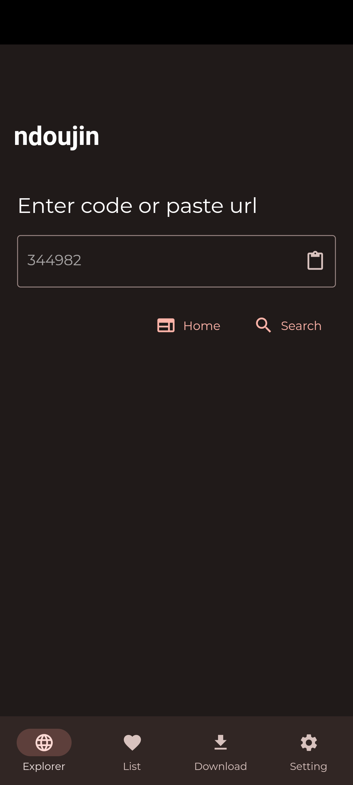
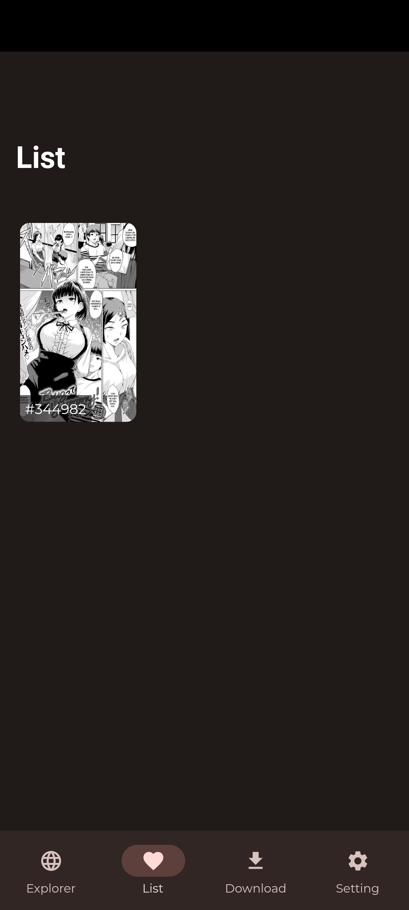
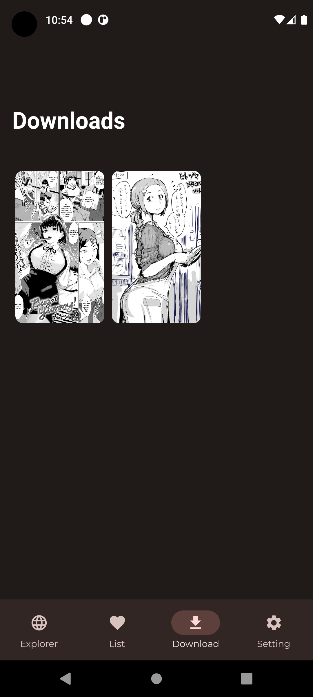
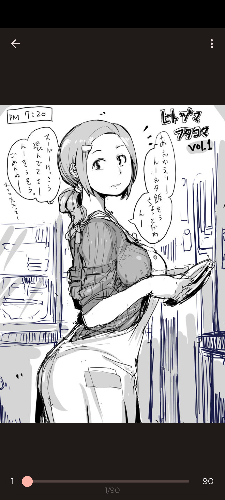
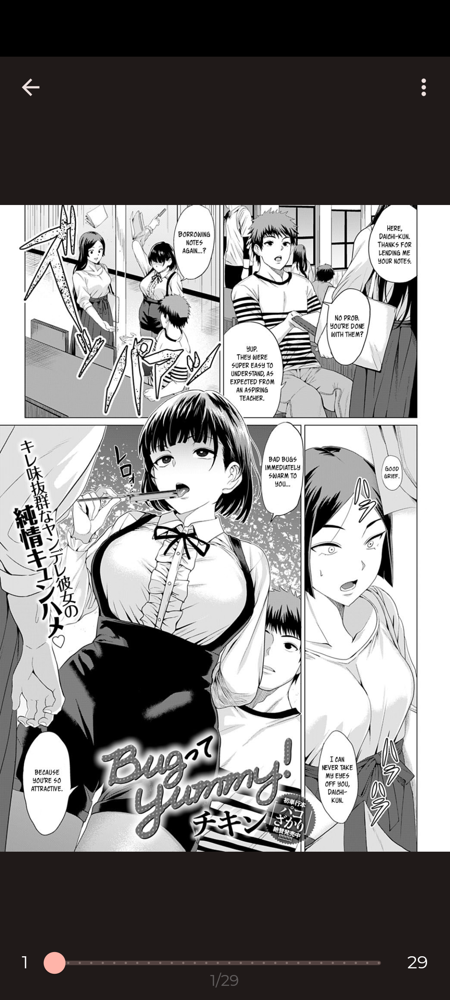

# ndoujin

### use this app only if you are 18+

## Screenshots

    

        
        
        
        
        
    

## Features

- Easy to create a list of favourite doujins.

- Download your favourite doujin

- Easy control

- Clean UI with Material You theme

## Supported Websites

- nhentai.net

## Installation

Download from [github](https://github.com/devyuji/ndoujin-app/releases)

### Reporting Bugs

If you encounter any bugs or issues while using our app, we encourage you to report them. To do so, please follow these steps:

1. Check the [existing issues](https://github.com/yourusername/your-repo-name/issues) to see if the bug has already been reported. If you find a similar issue, you can add additional information or provide your experience.

2. If your issue is not already reported, [create a new issue](https://github.com/yourusername/your-repo-name/issues/new/choose) by following the issue template. Please provide as much detail as possible, including a clear title, a description of the bug, steps to reproduce it, and any relevant logs or error messages.

3. Be sure to include the version of the app and the device/OS you're using. Screenshots and code examples are also helpful.

Thank you for helping us improve our app!

## Contributing

Pull requests are welcome. For major changes, please open an issue first to discuss what you would like to change.

Please make sure to update tests as appropriate.
